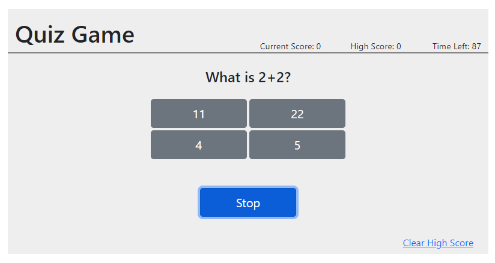

# 04 Web APIs: Code Quiz

This is a simple quiz game made in HTML and JS.
Questions will be asked in sequence at random, with a
timer ticking down.

Try to finish the quiz before the timer runs out!

Bootstrap components were used for UI implementation.

## Link to live website:

https://sinsinkun.github.io/UTOR-QuizGame

## Screenshot
